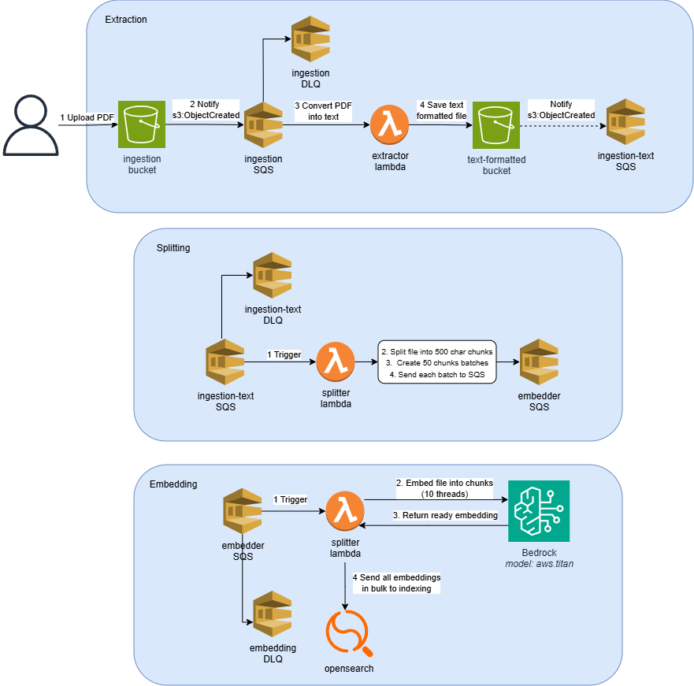
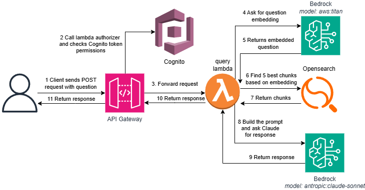

# RAG on Bedrock

A fully serverless document Q&A pipeline on AWS. Upload a PDF, ask a question, get an answer grounded only in that document — the model is explicitly instructed to say "I don't know" if the answer isn't in the context.

## Architecture

Process is divided for two independent flows that share only the vector database

### **Ingestion**
 A file uploaded to S3 triggers a chain of three Lambda functions: text extraction, chunking, and embedding. Each 500-character chunk is converted to a 1024-dimensional vector by Amazon Titan Embeddings V2. For efficiency, this is performed concurrently in 10 threads. Whenever all embeddings are ready, they are sent in bulk to OpenSearch Serverless for indexing. 



### **Quering** 
 A POST request to API Gateway reaches the Query Lambda. The Lambda embeds the incoming question with the same Titan model, performs a kNN search over OpenSearch Serverless to retrieve the 5 most relevant document chunks. Then, sends those chunks as context to Claude Sonnet to generate an answer grounded strictly in the source text. API access is protected by Cognito JWT authentication.



## Stack

| Layer | Choice |
|---|---|
| Compute | 4 Lambda functions (Python 3.14) |
| Vector store | OpenSearch Serverless — VECTORSEARCH collection, 1024-dim kNN |
| Embeddings | Amazon Titan Embeddings V2 |
| LLM | Claude Sonnet via Bedrock |
| Decoupling | SQS between every pipeline stage, DLQ on every queue |
| IaC | Terraform — two modules: `foundation` then `rag-stack` |

## Engineering notes

**Parallel embedding** — the Embedder Lambda fans out up to 10 concurrent Bedrock calls with `ThreadPoolExecutor`. Bedrock throttles aggressively on burst, so the boto3 client uses adaptive retry mode to back off automatically.

**Private networking** — VPC interface endpoints for Bedrock runtime, AOSS, SSM, and CloudWatch; S3 gateway endpoint. No NAT gateway, no public subnets, no egress cost.

**Fault tolerance** — every SQS queue has a dead-letter queue. A failing Lambda is retried 3 times before the message is moved to the DLQ where it waits 14 days for inspection.

## Why these choices?

**No NAT Gateway** — all AWS service traffic stays within the VPC via interface endpoints (Bedrock runtime, AOSS, SSM, CloudWatch) and an S3 gateway endpoint. This eliminates ~$32/month NAT cost and removes a public egress point.

**SQS between every stage** — decoupling Lambda functions via queues means each stage scales and fails independently. A downstream bottleneck doesn't cascade upstream.

**ThreadPoolExecutor for embeddings** — Bedrock's Titan Embeddings has per-minute token limits. Fanning out 10 concurrent calls with adaptive retry saturates the limit safely without manual backoff logic.

**DLQ on every queue** — a failing Lambda is retried 3 times before the message lands in the dead-letter queue, where it sits for 14 days. Nothing is silently dropped: you can inspect the payload, fix the root cause, and redrive — without re-uploading the original document.

**Streaming extraction for large PDFs** — the Extractor Lambda reads S3 object content directly via the streaming API rather than downloading to `/tmp`. Lambda's ephemeral storage is capped at 512 MB by default; streaming means a 200-page PDF is processed page-by-page without ever materialising the full file in memory.

**Adaptive retry mode** — the boto3 clients across all Lambdas use `retry_mode = adaptive`. Unlike standard exponential backoff, adaptive mode tracks the observed error rate and proactively reduces throughput before hitting a hard throttle. This matters most during the embedding fan-out: 10 concurrent Bedrock calls on a cold account would otherwise spike straight into `ThrottlingException`.

## Deploy

**Prerequisites:** AWS account with Bedrock model access (Titan Embeddings V2 + Claude Sonnet), Docker, Terraform ≥ 1.0, AWS CLI.

```bash
# One-time setup — installs tooling, creates .env
bash scripts/bootstrap.sh

# Build Lambda ZIPs and deploy
bash scripts/deploy-local.sh
```

## Usage

### Get a JWT token

After the first deploy, a Cognito user is created with the credentials from `COGNITO_USER_NAME` / `COGNITO_USER_PASSWORD`. Retrieve the `CLIENT_ID` and `api-gateway-url` from Terraform outputs:

```bash
terraform -chdir=terraform output -raw cognito_user_pool_client_id
terraform -chdir=terraform output -raw api_endpoint
```

**First login — set a permanent password**

The user starts in `FORCE_CHANGE_PASSWORD` state. Initiate auth to receive the challenge:

```bash
aws cognito-idp initiate-auth \
  --auth-flow USER_PASSWORD_AUTH \
  --auth-parameters USERNAME=<email>,PASSWORD=<temporary_password> \
  --client-id <CLIENT_ID> \
  --region eu-west-2
```

Respond to the `NEW_PASSWORD_REQUIRED` challenge using the `Session` value from the response above:

```bash
aws cognito-idp respond-to-auth-challenge \
  --client-id <CLIENT_ID> \
  --challenge-name NEW_PASSWORD_REQUIRED \
  --challenge-responses USERNAME=<email>,NEW_PASSWORD=<new_permanent_password> \
  --session "<SESSION>" \
  --region eu-west-2
```

This returns an `IdToken` and sets the password permanently.

**Subsequent logins**

```bash
aws cognito-idp initiate-auth \
  --auth-flow USER_PASSWORD_AUTH \
  --auth-parameters USERNAME=<email>,PASSWORD=<permanent_password> \
  --client-id <CLIENT_ID> \
  --region eu-west-2
```

Use the returned `IdToken` as a Bearer token in API requests.

### Query the API

After deploy, `runbook.sh` is generated in the project root with all values pre-filled. It contains ready-to-run commands for uploading documents and querying the API — no manual substitution needed.

```bash
# Upload a document
bash runbook.sh   # runs the upload command directly

# The file also contains copy-paste PowerShell and Bash snippets
# for getting a token and querying the API
cat runbook.sh
```

```json
{ "answer": "According to the document...", "sources": ["my-report.pdf"] }
```
